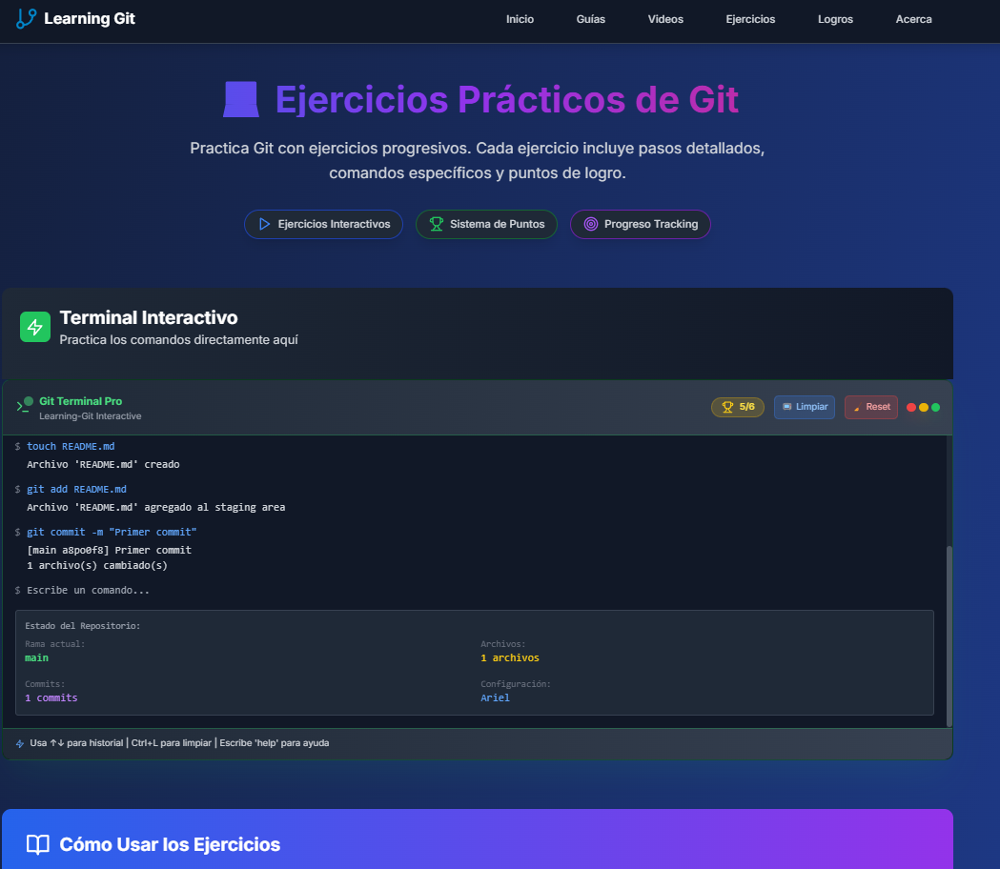
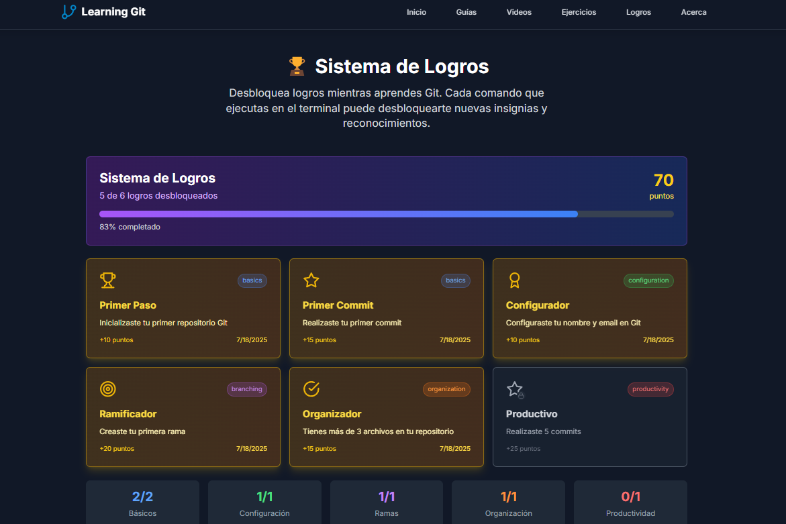

# 🚀 Learning Git - Terminal Interactivo

<div align="center">


### 🎯 La forma más divertida y práctica de aprender Git

[](https://github.com/mat1520/Learning-Git/stargazers)
[](https://github.com/mat1520/Learning-Git/network)
[](https://github.com/mat1520/Learning-Git/issues)
[](https://github.com/mat1520/Learning-Git/blob/main/LICENSE)

</div>

## 🌟 ¿Qué es Learning Git?

**Learning Git** es una aplicación web interactiva construida con **Next.js 14** que te permite aprender Git de manera práctica y divertida. Con un terminal simulado, sistema de logros gamificado, guías detalladas y videos explicativos, es la herramienta perfecta para dominar el control de versiones.

---

## ✨ Características Principales

### 🖥️ Terminal Interactivo



- ✅ **Simulación realista** de comandos Git
- ✅ **30+ comandos soportados** (git init, commit, branch, merge, etc.)
- ✅ **Feedback en tiempo real** con colores y mensajes
- ✅ **Historial de comandos** navegable con ↑/↓
- ✅ **Limpieza completa** con `clear` y `reset-repo`
- ✅ **Autocompletado** y sugerencias inteligentes

### 🏆 Sistema de Logros Gamificado



**¡26 logros únicos para desbloquear!**

#### 🔰 Categorías de Logros:
- **Básicos** (5 logros) - Primeros pasos con Git
- **Configuración** (2 logros) - Setup y personalización  
- **Ramas** (4 logros) - Branching y navegación
- **Organización** (5 logros) - Gestión de archivos
- **Productividad** (6 logros) - Flujos eficientes
- **Experto** (4 logros) - Logros avanzados

#### 🎯 Logros Destacados:
- 🏆 **Gurú del Git** (100 pts) - Desbloquea 15 logros
- 🏅 **Constructor** (40 pts) - Maneja +10 archivos
- ⚡ **Explorador de Comandos** (60 pts) - Usa 10 comandos diferentes
- 🎯 **Perfeccionista** (20 pts) - Commits descriptivos

### 📚 Guías Completas


**12 guías estructuradas por niveles:**

#### 🌱 Principiante (4 guías)
- 🚀 Introducción Completa a Git
- 🌱 Tu Primer Repositorio Git  
- 📊 Ciclo de Vida de Archivos
- 🔒 Gestión con .gitignore

#### 🚀 Intermedio (4 guías)
- 🌳 Ramas Profesionales
- ⚔️ Merge y Resolución de Conflictos
- 🔍 Arqueología de Código
- ☁️ Repositorios Remotos Pro

#### 🏆 Avanzado (4 guías)
- 🎯 Rebase Interactivo Master
- 🏢 Flujos Empresariales
- 🤖 Git Hooks y Automatización
- 📦 Técnicas Profesionales

### 🎥 Videos Educativos


**12 videos cuidadosamente seleccionados:**

- ✅ **Contenido verificado** de canales populares
- ✅ **Organizados por niveles** de dificultad
- ✅ **Duraciones optimizadas** para el aprendizaje
- ✅ **Enlaces funcionales** a YouTube
- ✅ **Temas específicos** y prácticos

---

## 🚀 Comenzar Ahora

### 🔧 Instalación Local

```bash
# Clonar el repositorio
git clone https://github.com/mat1520/Learning-Git.git

# Navegar al directorio
cd Learning-Git

# Instalar dependencias
npm install

# Iniciar servidor de desarrollo
npm run dev
```

🌐 **¡Visita [localhost:3000](http://localhost:3000) y comienza a aprender!**

### 📦 Stack Tecnológico

- ⚡ **Next.js 14** - React Framework
- 🎨 **Tailwind CSS** - Styling
- 💾 **LocalStorage** - Persistencia de datos
- 🎯 **TypeScript** - Type safety
- 🎨 **Lucide Icons** - Iconografía moderna

---

## 🎮 Cómo Usar

### 1️⃣ **Terminal Interactivo**
```bash
# Comandos básicos para empezar
help                    # Ver comandos disponibles
git init               # Inicializar repositorio
git config user.name "Tu Nombre"
touch README.md        # Crear archivo
git add README.md      # Agregar al staging
git commit -m "Mi primer commit"
```

### 2️⃣ **Navegación**
- 🏠 **Inicio**: Terminal interactivo principal
- 📚 **Guías**: Tutoriales paso a paso
- 🎥 **Videos**: Contenido multimedia
- 🏆 **Logros**: Progreso y gamificación
- ℹ️ **Acerca**: Información del proyecto

### 3️⃣ **Comandos Especiales**
- `clear` / `cls` - Limpiar pantalla
- `reset-repo` - Reiniciar repositorio completo
- `help` - Ver todos los comandos disponibles

---

## 🌟 Características Únicas

### 💡 **Aprendizaje Progresivo**
- Sistema de puntos y niveles
- Retroalimentación inmediata
- Desafíos incrementales

### 🎨 **Interfaz Moderna**
- Diseño responsive
- Modo oscuro nativo
- Animaciones fluidas
- UX optimizada

### 🔍 **Simulación Realista**
- Comportamiento auténtico de Git
- Mensajes de error reales
- Estados de archivos precisos

---

## 🤝 Contribuir

¿Quieres mejorar Learning Git? ¡Las contribuciones son bienvenidas!

### 📋 Cómo Contribuir:
1. 🍴 Fork el proyecto
2. 🌿 Crea tu rama (`git checkout -b feature/AmazingFeature`)
3. ✨ Commit tus cambios (`git commit -m 'Add some AmazingFeature'`)
4. 📤 Push a la rama (`git push origin feature/AmazingFeature`)
5. 🔃 Abre un Pull Request

### 💡 Ideas de Contribución:
- 🆕 Nuevos comandos Git
- 🏆 Más logros y desafíos
- 📚 Guías adicionales
- 🐛 Reportes de bugs
- 🎨 Mejoras de UI/UX

---

## 💝 Apoyar el Proyecto

Si **Learning Git** te ha sido útil, considera apoyar el desarrollo:

<div align="center">

### ☕ Invítame un café

[](https://www.paypal.com/paypalme/ArielMelo200?country.x=EC&locale.x=es_XC)
[](https://ko-fi.com/arielmelo)

### 💬 Comunidad

[](https://t.me/MAT3810)

</div>

### 🌟 Otras formas de apoyar:
- ⭐ **Dale una estrella** al repositorio
- 🔄 **Comparte** con otros developers
- 🐛 **Reporta bugs** para mejorar la app
- 💡 **Sugiere nuevas funcionalidades**

---

## ️ Roadmap

### 🔜 Próximas Funcionalidades:
- [ ] 🌐 **Modo Colaborativo** - Simular trabajo en equipo
- [ ] 📱 **App Móvil** - React Native version
- [ ] 🤖 **IA Assistant** - Ayuda inteligente con comandos
- [ ] 🏆 **Torneos** - Competencias entre usuarios
- [ ] 📈 **Analytics** - Estadísticas de progreso
- [ ] 🎵 **Audio** - Efectos de sonido y música

### ✅ Completado:
- [x] 🖥️ Terminal interactivo completo
- [x] 🏆 Sistema de logros (26 logros)
- [x] 📚 12 guías estructuradas
- [x] 🎥 Videos educativos integrados
- [x] 🎨 UI/UX moderna y responsive
- [x] 💾 Persistencia de datos local

---

## 📄 Licencia

Este proyecto está bajo la licencia **MIT**. Consulta el archivo [LICENSE](LICENSE) para más detalles.

---

## 👨‍💻 Autor

<div align="center">

### **Ariel Melo**
*Full Stack Developer & Git Enthusiast*

[](https://github.com/mat1520)
[](https://t.me/MAT3810)

</div>

---

## 🙏 Agradecimientos

- **Linus Torvalds** por crear Git
- **Vercel** por el hosting
- **Comunidad Open Source** por la inspiración
- **Todos los contributores** que han mejorado el proyecto

---

<div align="center">

### 🚀 ¿Listo para dominar Git?

**[⚡ COMENZAR AHORA ⚡](http://localhost:3000)**

*Hecho con ❤️ para la comunidad developer*

</div>
